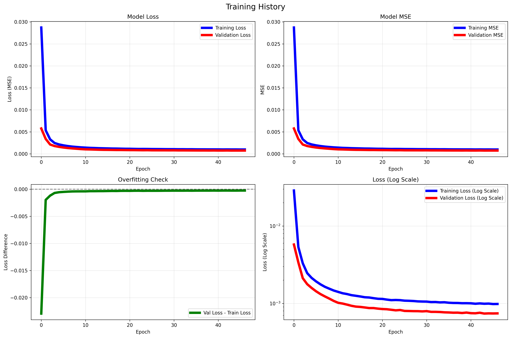

# Song Recommendation System

## Overview

This project is a song recommendation system that leverages a deep learning autoencoder model to provide personalized song suggestions. The system works by learning latent representations of songs—capturing both numerical features and categorical data such as artist, genre, and emotion. At its core, the autoencoder neural network compresses high-dimensional song data into a lower-dimensional latent space, effectively distilling the essential characteristics of each song. Recommendations are then generated by identifying songs that are close to each other in this latent space, ensuring that users receive suggestions that closely match their musical preferences.

## Model Architecture

The model consists of an autoencoder with separate input paths for numerical and categorical data:

- **Inputs**:
  - Numerical input for song features (17 features) (tempo, energy, liveness, etc).
  - Categorical inputs for artist, genre, and emotion.
- **Embedding Layers**:
  - Artist Embedding: Maps artist IDs to a 100-dimensional vector.
  - Genre Embedding: Maps genre IDs to a 50-dimensional vector.
  - Emotion Embedding: Maps emotion IDs to a 25-dimensional vector.
- **Encoder**:
  - Concatenates numerical and embedding inputs.
  - Uses dense layers with ReLU activation and dropout for regularization.
  - Outputs a 20-dimensional latent vector representing the compressed song data (aligned with 20 total features).
- **Decoder**:
  - Reconstructs the input data from the latent vector using dense layers.
  - Aims to minimize reconstruction loss (Mean Squared Error).
- **Training**:
  - Trained on a kaggle dataset coming from https://www.kaggle.com/datasets/devdope/900k-spotify/data?select=spotify_dataset.csv of song data.
  - Trained on a singular 4070-ti Super Geforce gpu

The system also includes a separate encoder model to map songs directly to the latent space for recommendation purposes.

## Data

The dataset used for training and evaluation is sourced from Spotify and includes:

- **Raw Data**: `spotify_dataset.csv` (1.1GB) - The original dataset containing song information.
- **Pre-processed Data**: `pre-processed-data.csv` (69MB) - Processed numerical and categorical features ready for model input.
- **Latent Space Lookup**: `latent-space-lookup.csv` (239MB) - Stores the latent representations of songs for quick recommendation lookups.
- **other .json files**: JSON files for artists, genres, and emotions IDS, along with normalization parameters and data counts.

## Additional Details

- **Scripts**: The project includes scripts for data preprocessing (`data.py`), model definition and training (`autoencoder.py`), recommendation logic (`Recommender.py`), and visualization (`visualize.py`).
- **Visualizations**: Tools to visualize the latent space and training history are provided in the `visualizations` directory.
- **API and Frontend**: The system is integrated with a backend API (`api` directory) and a Next.js frontend application (`next-app` directory) for user interaction.
- **Model Storage**: Trained models are saved as `autoencoder-model.keras` and `encoder-model.keras` in the `models` directory for reuse.

## Model Performance

The autoencoder model demonstrates excellent performance and meaningful latent space representation, as evidenced by the training metrics and visualizations:

### Training Results



The training history shows:

- **Convergence**: Both training and validation loss converge smoothly, indicating stable learning
- **No Overfitting**: The validation loss closely follows the training loss without significant divergence
- **Effective Learning**: Loss decreases from ~0.04 to ~0.001 over approximately 18 epochs
- **Early Stopping**: The model benefits from early stopping to prevent overfitting, as shown in the overfitting check plot

### Latent Space Visualization


The t-SNE visualization of the 20-dimensional latent space expressed in 2 dimensions reveals:

- **Balanced Clustering**: Songs form clusters but not overly tight groupings, indicating the model has learned meaningful patterns without overfitting
- **Mixed Representations**: Each cluster contains multiple colors across all three visualizations (genre, artist, emotion), demonstrating that the model avoids over-emphasizing any single categorical feature from the embedding layers
- **Genre Clustering**: Songs are naturally grouped by genre (left panel) while maintaining diversity within clusters
- **Artist Separation**: Clear artist-based clustering (middle panel) shows the model learns artist-specific characteristics without creating isolated artist-only groups
- **Emotion Mapping**: Emotional attributes create meaningful patterns in the latent space (right panel) while preserving cross-emotional similarities

This balanced clustering behavior is crucial for effective recommendations - it shows the autoencoder has learned to weight the embedding layers (artist, genre, emotion) appropriately without letting any single categorical feature dominate the latent representation. The presence of multiple colors within each cluster confirms the model captures nuanced musical relationships beyond simple categorical boundaries.

These visualizations confirm that the autoencoder successfully learns meaningful representations that respect musical similarity across multiple dimensions (genre, artist, and emotion), making it highly effective for recommendation tasks.

## Installation and Usage

To run this project locally:

1. **Clone the repository**:

   ```bash
   git clone https://github.com/yourusername/song-recommendation-system.git
   cd song-recommendation-system
   ```

2. **Install dependencies** listed in `requirements.txt`:

   ```bash
   pip install -r requirements.txt
   ```

3. **Run data preprocessing scripts(Change amount of input data if necessary)** (`scripts/data.py`):

   ```bash
   python scripts/data.py
   ```

4. **Train the model** using `scripts/autoencoder.py` or load pre-trained models from the `models` directory:

   ```bash
   python scripts/autoencoder.py

   ```

5. **Save the latent spaces of the trained model** using `scripts/Latent-Space-Mapping.py` for constant time latent space lookups

```bash
python scripts/Latent-Space-Mapping.py

```

6. **Run the Recommender** using `scripts/Recommender.py` to get a song recommendation. Feel free to change data inside of the file

7. **Start the API server** and frontend application for user interaction(optional):
   - For the API server (assuming it's in the `api` directory and uses a framework like Flask or FastAPI):
     ```bash
     python -m api.server
     ```
   - For the frontend application (assuming it's a Next.js app in the `next-app` directory):
     ```bash
     cd next-app
     npm install  # Install frontend dependencies
     npm run dev  # Start the development server
     ```

## Contributing

Contributions to improve the model, add features, or enhance the user interface are welcome. Please submit pull requests or open issues for discussion.

## License

[Specify your license here, if applicable.]
